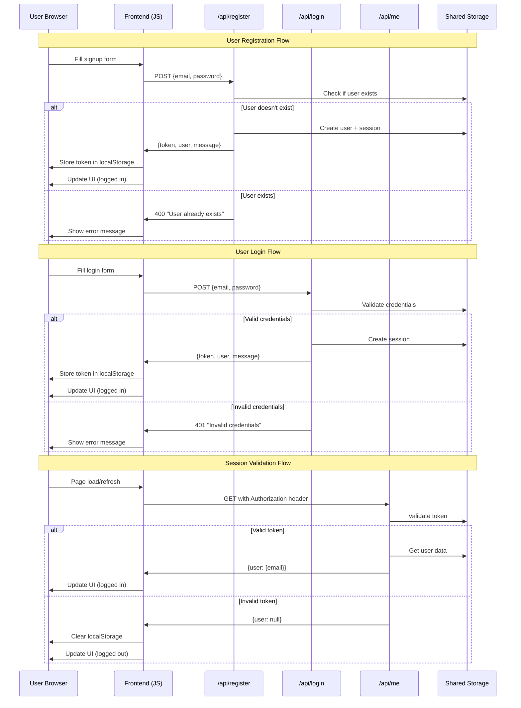
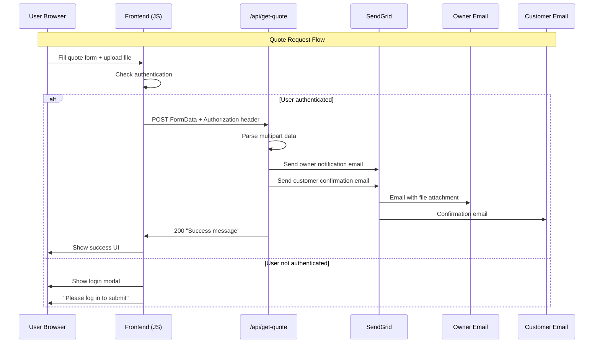

# things3D Website - Typed Architecture Diagram

```mermaid
graph TB
    %% External Services
    Azure[Azure Static Web Apps]
    GitHub[GitHub Repository]
    Browser[User Browser]
    
    %% Frontend Layer
    subgraph "Frontend Layer"
        HTML[index.html]
        CSS[Tailwind CSS]
        JS[JavaScript]
        
        subgraph "UI Components"
            Header[Header & Navigation]
            Hero[Hero Section]
            Gallery[Gallery Section]
            QuoteForm[Quote Form Section]
            LoginModal[Login Modal]
            SignupModal[Signup Modal]
        end
        
        subgraph "Client State"
            LocalStorage[localStorage]
            AuthToken[authToken: string]
            UserEmail[userEmail: string]
            ClientPrincipal[clientPrincipal: Object]
        end
    end
    
    %% API Layer
    subgraph "API Layer (Azure Functions)"
        subgraph "Authentication APIs"
            RegisterAPI["/api/register"]
            LoginAPI["/api/login"]
            MeAPI["/api/me"]
            LogoutAPI["/api/logout"]
        end
        
        subgraph "Business APIs"
            QuoteAPI["/api/get-quote"]
            ListUsersAPI["/api/list-users"]
            AdminAPI["/api/admin-users"]
        end
        
        subgraph "Shared Modules"
            SharedStorage["/api/shared/storage.js"]
        end
    end
    
    %% Data Layer
    subgraph "Data Layer"
        subgraph "In-Memory Storage (Current)"
            UserMap[users: Map<email, User>]
            SessionMap[sessions: Map<token, Session>]
        end
        
        subgraph "Future: Azure Storage"
            AzureTable[Azure Table Storage]
            UserTable[users table]
            SessionTable[sessions table]
        end
    end
    
    %% Email Service
    subgraph "Email Service"
        SendGrid[SendGrid API]
        OwnerEmail[Owner Notification]
        CustomerEmail[Customer Confirmation]
    end
    
    %% Deployment Pipeline
    subgraph "CI/CD Pipeline"
        GitHubActions[GitHub Actions]
        AzureDeploy[Azure Deploy Action]
        Oryx[Oryx Build System]
    end
    
    %% Type Definitions
    subgraph "Type Definitions"
        UserType[User: {email, passwordHash, createdAt}]
        SessionType[Session: {email, token, createdAt, expiresAt}]
        AuthResponseType[AuthResponse: {message, token, user}]
        QuoteRequestType[QuoteRequest: {name, email, file, instructions}]
    end
    
    %% Connections
    Browser --> HTML
    HTML --> CSS
    HTML --> JS
    
    JS --> LocalStorage
    LocalStorage --> AuthToken
    LocalStorage --> UserEmail
    JS --> ClientPrincipal
    
    JS --> RegisterAPI
    JS --> LoginAPI
    JS --> MeAPI
    JS --> LogoutAPI
    JS --> QuoteAPI
    
    RegisterAPI --> SharedStorage
    LoginAPI --> SharedStorage
    MeAPI --> SharedStorage
    LogoutAPI --> SharedStorage
    ListUsersAPI --> SharedStorage
    AdminAPI --> SharedStorage
    
    SharedStorage --> UserMap
    SharedStorage --> SessionMap
    
    QuoteAPI --> SendGrid
    SendGrid --> OwnerEmail
    SendGrid --> CustomerEmail
    
    GitHub --> GitHubActions
    GitHubActions --> AzureDeploy
    AzureDeploy --> Oryx
    Oryx --> Azure
    Azure --> Browser
    
    %% Future connections (dashed)
    SharedStorage -.-> AzureTable
    AzureTable -.-> UserTable
    AzureTable -.-> SessionTable
    
    %% Styling
    classDef frontend fill:#e3f2fd
    classDef api fill:#f3e5f5
    classDef data fill:#e8f5e8
    classDef external fill:#fff3e0
    classDef future fill:#fafafa,stroke-dasharray: 5 5
    
    class HTML,CSS,JS,Header,Hero,Gallery,QuoteForm,LoginModal,SignupModal,LocalStorage,AuthToken,UserEmail,ClientPrincipal frontend
    class RegisterAPI,LoginAPI,MeAPI,LogoutAPI,QuoteAPI,ListUsersAPI,AdminAPI,SharedStorage api
    class UserMap,SessionMap,UserType,SessionType,AuthResponseType,QuoteRequestType data
    class Azure,GitHub,Browser,SendGrid,GitHubActions,AzureDeploy,Oryx,OwnerEmail,CustomerEmail external
    class AzureTable,UserTable,SessionTable future
```

## Authentication Flow Diagram



## Quote Submission Flow Diagram



## File Structure Overview

```
things3D/
├── 📄 index.html                 # Main frontend application
├── 📄 package.json              # Root package config
├── 📄 staticwebapp.config.json  # Azure SWA configuration
├── 📄 .gitignore                # Git ignore rules
├── 📁 .github/workflows/        # CI/CD pipeline
│   └── 📄 azure-static-web-apps-gentle-coast-0f6dbdb10.yml
└── 📁 api/                      # Azure Functions backend
    ├── 📄 host.json             # Functions runtime config
    ├── 📄 package.json          # API dependencies
    ├── 📄 local.settings.json.example
    ├── 📁 shared/
    │   └── 📄 storage.js        # Shared in-memory storage
    ├── 📁 register/             # User registration
    │   ├── 📄 function.json
    │   └── 📄 index.js
    ├── 📁 login/                # User authentication
    │   ├── 📄 function.json
    │   └── 📄 index.js
    ├── 📁 me/                   # Session validation
    │   ├── 📄 function.json
    │   └── 📄 index.js
    ├── 📁 logout/               # Session termination
    │   ├── 📄 function.json
    │   └── 📄 index.js
    ├── 📁 get-quote/            # Quote submission
    │   ├── 📄 function.json
    │   └── 📄 index.js
    ├── 📁 list-users/           # User listing (testing)
    │   ├── 📄 function.json
    │   └── 📄 index.js
    └── 📁 admin-users/          # Admin panel (testing)
        ├── 📄 function.json
        └── 📄 index.js
```

## Technology Stack

### Frontend
- **HTML5**: Semantic markup
- **Tailwind CSS**: Utility-first styling
- **Vanilla JavaScript**: Client-side logic
- **localStorage**: Client-side session storage

### Backend
- **Azure Functions**: Serverless API endpoints
- **Node.js**: Runtime environment
- **Azure Static Web Apps**: Hosting platform

### Data Storage
- **Current**: In-memory storage (testing)
- **Future**: Azure Table Storage (production)

### External Services
- **SendGrid**: Email delivery service
- **GitHub Actions**: CI/CD pipeline

### Development Tools
- **GitHub**: Version control
- **VSCode**: Development environment
- **Azure Portal**: Cloud resource management

## Security Features

### Authentication
- ✅ Password hashing (SHA-256)
- ✅ Session token generation
- ✅ Token-based authorization
- ✅ Session expiration (24 hours)

### API Security
- ✅ Input validation
- ✅ Error handling
- ✅ CORS configuration
- ✅ Content Security Policy

### Future Enhancements
- 🔄 bcrypt password hashing
- 🔄 JWT tokens
- 🔄 Rate limiting
- 🔄 Azure AD integration

## Deployment Architecture

```mermaid
graph LR
    Dev[Developer] --> Git[Git Push]
    Git --> GHA[GitHub Actions]
    GHA --> Build[Oryx Build]
    Build --> Deploy[Azure Deploy]
    Deploy --> SWA[Azure Static Web Apps]
    SWA --> CDN[Global CDN]
    CDN --> Users[End Users]
    
    classDef process fill:#e3f2fd
    classDef service fill:#f3e5f5
    classDef user fill:#e8f5e8
    
    class Dev,Git,GHA,Build,Deploy process
    class SWA,CDN service
    class Users user
```



## API Endpoints Reference

| Endpoint | Method | Purpose | Auth Required |
|----------|--------|---------|---------------|
| `/api/register` | POST | User registration | No |
| `/api/login` | POST | User authentication | No |
| `/api/me` | GET | Session validation | Yes |
| `/api/logout` | POST | Session termination | Yes |
| `/api/get-quote` | POST | Quote submission | Yes |
| `/api/list-users` | GET | User listing (testing) | No |
| `/api/admin-users` | GET | Admin panel (testing) | Admin Key |

## Current Status & Next Steps

### ✅ Completed
- Custom authentication system
- Quote submission with file upload
- Email notifications
- Responsive UI design
- CI/CD pipeline

### 🔄 In Progress
- Deployment debugging
- Azure Storage integration
- Production environment setup

### 📋 Future Enhancements
- User dashboard
- Order tracking
- Payment integration
- Advanced file processing
- Real-time notifications
